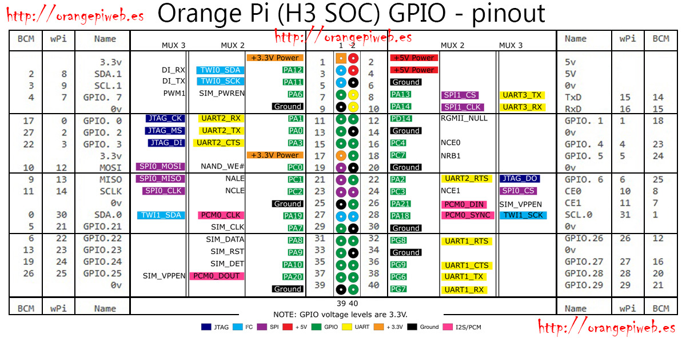

He utilitzat [armbian](https://www.armbian.com/orange-pi-one/) 20.05.2 basada en Buster (Debian 10), però baixant la versió actual hauria de funcionar igual.

Una vegada restaurada la imatge a una SD de 32 GB (jo he utilitzat l'eina Discs del meu Ubuntu) la posem a l'Orange Pi one i connectem la placa a la xarxa i aun carregador USB de 2A.

Localitzem a la xarxa quina IP ha agafat la placa (en el meu cas 192.168.1.136)

Ens connectem a la placa per xarxa des d'un terminal (contrasenya de *root* **1234**)

     ssh root@192.168.1.136

Ens obliga a canviar la contrasenya de *root* i crear un nou usuari. En el meu cas he creat l'usuari *jordi*, el mateix que faig servir a la meva màquina principal.

Actualitzem els paquets

     apt update
     apt upgrade

Configurem el sistema amb

    armbian-config
    
A *Personal settings -> Timezone* canviem el fus horari

A *Personal settings -> Hostname* canviem el nom de la màquina per *cluster1*

A *System -> Hardware* activem el bus GPIO **w1-gpio**

Instal·lem *mc*

    apt install mc

Reiniciem el sistema

    reboot
    
Ens tornem a connectar com a *root* i seguint les instruccions de [https://orangepiweb.es/gpio.php](https://orangepiweb.es/gpio.php) preparem el port GPIO per a python3:

    apt install python3-dev python3-setuptools swig python3-pip python3-wheel 
    git clone https://github.com/zhaolei/WiringOP.git -b h3
    cd WiringOP
    ./build
    cd ..
    git clone https://github.com/duxingkei33/orangepi_PC_gpio_pyH3.git
    cd orangepi_PC_gpio_pyH3/
    python3 setup.py install
    
Ara podem veure l'estat del GPIO amb 

    gpio readall

Però el nom dels pins que hem de fer servir amb aquesta llibreria de Python són aquests que veieu en color verd:

Ja podeu connectar el mòdul de 6 leds als pins senars 27-39 del connector i provar l'exemple [testleds.py](python3/testleds.py). Potser us caldrà abans fer una altra vegada reboot.

    cd ..
    wget https://raw.githubusercontent.com/jorts64/ClusterOrangePiOne/master/python3/testleds.py
    chmod u+x testleds.py
    ./testleds.py

