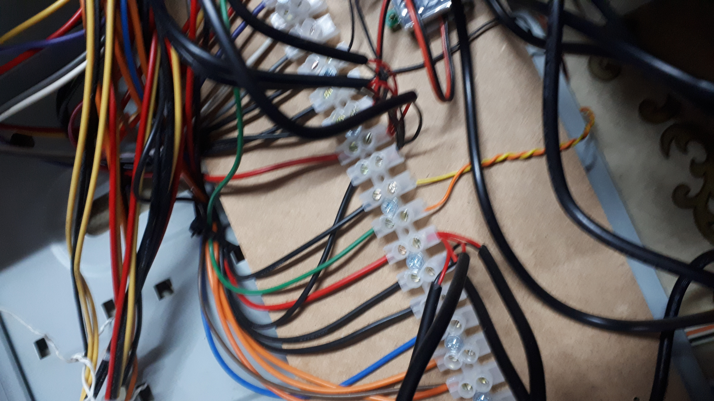

# Muntatge del cluster

He fet servir una bella torre de PC amb font ATX. He afegit alguns connectors USB, sempre es necessiten! ( i el de color negre va a 5VSB, que sempre funciona fins-i-tot amb la font en standby)

He tallat el connector de la motherboard i connectat els cables amb regletes de 10 A

La font ens dona 36A a 5V, perfecte pel nostre projecte. Altres tensions seran útils per a altres usos de la capsa. Això si, caldra connectar un interruptor entre GND i el cable verd per controlar la font.

Cada placa Orange Pi One té el seu cable d'alimentació (que tallarem per connectar a la regleta) i la seva cinta per connectar el mòdul de leds.

Els mòduls de leds van col·locats a una de les tapes, aquesta impressa en 3D

Preparem totes les plaques amb el programari instal·lat a la seva SD i els seus cables

El switch va enganxat a una altra tapa, aquesta de fusta, amb cables de 1m

El switch sobresurt una mica de la tapa de fusta per mostrar els seus leds. També preparem un cable per connectar a 5V l'alimentació

Connectem cada tarja al switch i fixem el conjunt amb cargols M3

Connectem les alimentacions de les plaques i el switch en grups de 4 a les regletes (4x2A=8A < 10A)

Una vegada fixades totes les plaques ordenem una mica el conjunt

He aprofitat les bahies de 5" per posar uns calaixos impresos en 3D per a eines, i fins i tot una connexió de 12V per dremels i altres eines i instruments.

Finalment connectem a la xarxa i a 220V, engegem el sistema i tot funciona perfecte.

